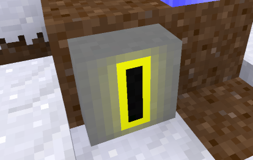

# Item acceptor (`item_acceptor`)


## Depends

default, mesecons, mesecons_gamecompat, mesecons_receiver

## What is this

This node allows you to trade services.
To configure a node, just place an itemstack onto a top cell. This is the price
that you'd loke to take. Now if a customer rightclick it with a stack of the same
items in his hands, that stack will be taken from him and placed into acceptor's
main inventory and the acceptor will light mesecon signal, just like a mesecon
button. If there are not enough items in customer's hand or he's wielding something
else or nothing, then the acceptor just won't work. It won't work also if not
configured (no items in the top cell) or full.

## Crafting recipe

```
I - iron ingot
C - default chest
M - mesecon wire

III
 CM
III
```

## Known issues

Some items cannot be used, as they have on_place redefined weirdly.

## Screenshot




## License

© 2024, Nikita Egorov <ghaydn@mail.ru>

License for all code: AGPL 3.0
License for all media and all other assets:  CC-BY-SA 4.0

see LICENSE.txt
